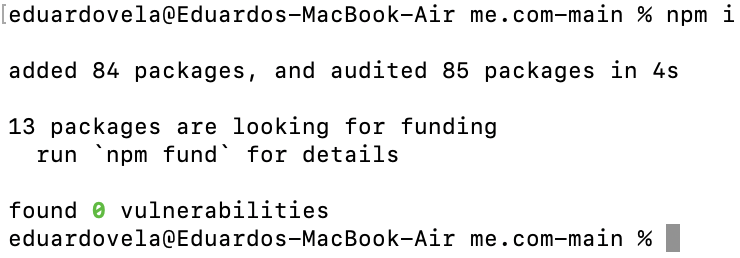

# me.com

## Description

me.com is a server that hosts a simple API for a social media web application. The API allows the application to create, read, update, and delete information of Users, Thoughts, and Reactions which are the data models the web app uses. The data is stored in a NoSQL database which is MongoDB, while for the routes Express.js is used and for the data models Mongoose. I created this project to see how a NoSQL database such as MongoDB works, and I learned that this kind of database offers a lot more flexibility when compared with its more rigid SQL counterparts, since data models don’t have to follow strict rules. Also I learned how to use a ODM (Object-Document-Mapping) library such as Mongoose, which allowed me to create, read, update, and delete documents from the database using JavaScript.

## Table of Contents

- [Installation](#installation)
- [Usage](#usage)
- [Credits](#credits)
- [License](#license)

## Installation

After you have installed MonjoDB in your computer, you can now download the source code of me.com, by clicking the green “Code” button and then choosing the “Download ZIP” option. Once the source code has been downloaded, you can start me.com by opening a terminal or console in its folder location and running the following commands:

- “npm i” (To install the npm dependencies me.com uses)
- “npm run seed” (To load the optional sample data of me.com)
- “npm start” (To run the me.com server)

And thats it! To learn how to use me.com, check out the “Usage” section of the README.

### Green "Code" Button

### "Download ZIP" Button

### The "npm i" command

### The "npm run seed" command

### The "npm start" command

## Usage

To learn how to use me.com, watch the following walkthrough video: https://drive.google.com/file/d/177hwZTqwwxpKRfU-3JI_71e0QnBbht1U/view?usp=sharing

## Credits

- To learn about the different data types of Mongoose Schema:

  - Mongoose. (n.d.). Schematypes. Mongoose v8.5.1: SchemaTypes. https://mongoosejs.com/docs/schematypes.html

- To learn about validation for Mongoose Schema:

  - Mongoose. (n.d.). Validation. Mongoose v8.5.1: Validation. https://mongoosejs.com/docs/validation.html

- To learn how to use the “populate” method:

  - Mongoose. (n.d.). Populate. Mongoose v8.5.1: Populate. https://mongoosejs.com/docs/populate.html

- To delete the Thoughts of a User when it is deleted:

  - Mongoose. (n.d.). Model. Mongoose v8.5.1: Model. https://mongoosejs.com/docs/api/model.html#Model.deleteMany()

## License

me.com is licensed under the MIT license
